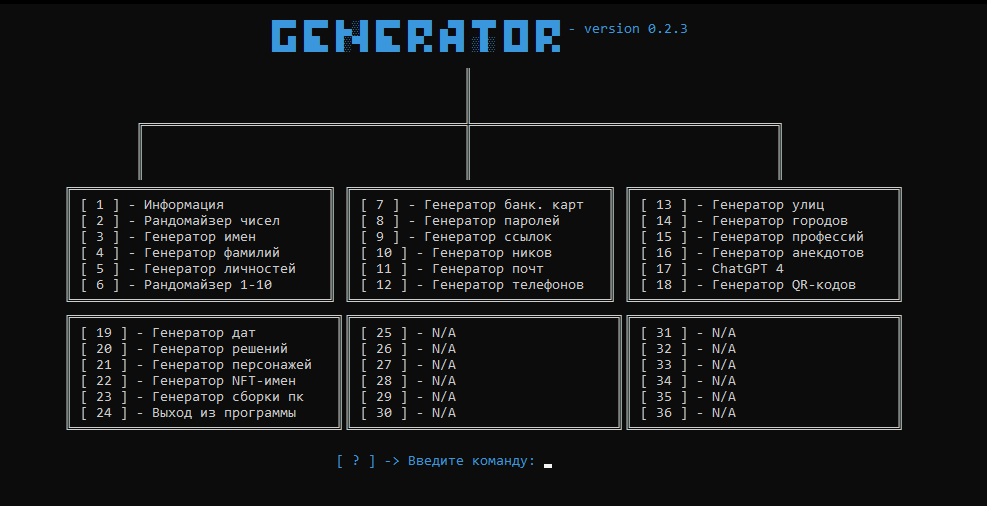

# Generator 
___
## Описание:
#### Это небольшой генератор на python, который может генерировать многое.

**Функционал:**
- Рандомайзер цифр
- Генератор ру имён
- Генератор фамилий
- Генератор личностей
- Рандомайзер от 1 до 10
- Генератор банк. карт
- Генератор паролей
- Генератор ссылок
- Генератор ников
- Генератор почт
- Генератор тел.номеров
- Генератор улиц
- Генератор городов
- Генератор профессий
- Генератор анекдотов
- ChatGPT
- Генератор QR-кодов
- Генератор дат
- Генератор решений
- Генератор персонажей
- Генератор NFT-названий коллекций
- Генератор сборки компьютера

___

___
Все используемые библиотеки: 
```python
import random
import time
import g4f
import segno
import banner
from person import *
from faker import Faker
from colorama import init
from colorama import Fore
init()
```
___

Связь: [Telegram](https://t.me/marjaway) / Discord: marjaway
